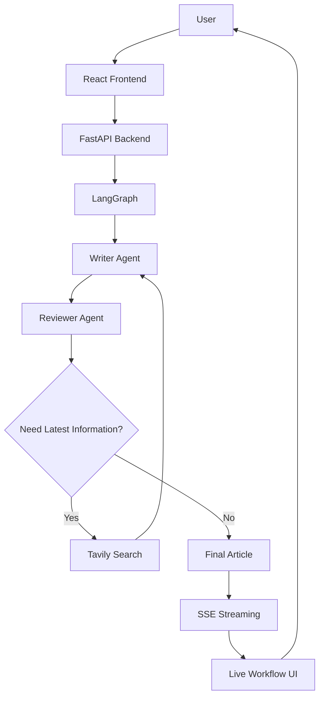
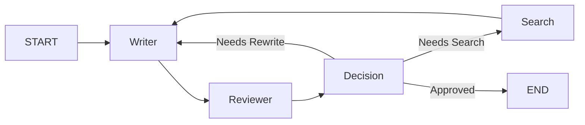
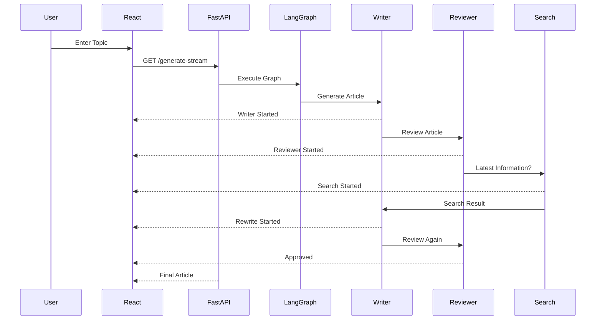

# 🚀 LangGraph Multi-Agent Article Generator

::: {align="center"}
### Intelligent Multi-Agent Content Generation using **LangGraph**, **LangChain**, **FastAPI**, **React**, **Mistral AI**, **Tavily Search**, and **Server-Sent Events (SSE)**


:::

------------------------------------------------------------------------

## 📌 Overview

This project demonstrates an **Agentic AI workflow** built with
**LangGraph**.

Instead of relying on a single LLM call, the system orchestrates
multiple specialized AI agents:

-   ✍️ Writer Agent
-   🧐 Reviewer Agent
-   🌐 Internet Search Agent
-   🔄 Automatic Rewrite Loop

The Reviewer validates every generated article against the original user
request. When factual verification is required, it invokes Tavily
Search. The Writer then rewrites the article using reviewer feedback and
retrieved information until the Reviewer approves it.

The frontend visualizes the execution in real time using **Server-Sent
Events (SSE)**.

------------------------------------------------------------------------

# ✨ Features

-   Multi-Agent Architecture
-   LangGraph State Management
-   Conditional Routing
-   Automatic Review & Rewrite
-   Internet Search Integration (Tavily)
-   Real-Time Workflow Streaming (SSE)
-   FastAPI REST API
-   React + Tailwind Frontend
-   Responsive UI
-   Modular Agent Design

------------------------------------------------------------------------

# 🏗 High-Level System Architecture



------------------------------------------------------------------------

# 🤖 Multi-Agent Workflow



------------------------------------------------------------------------

# 🔄 Runtime Execution

``` text
User Request
      │
      ▼
Writer Agent
      │
      ▼
Reviewer Agent
      │
      ├───────────────► Approved
      │                    │
      │                    ▼
      │                 Final Article
      │
      ▼
Internet Search
      │
      ▼
Writer Agent (Rewrite)
      │
      ▼
Reviewer Agent
      │
      ▼
Approved
```

------------------------------------------------------------------------

# 🧠 Agent Responsibilities

## ✍️ Writer Agent

-   Generates initial article
-   Rewrites article using reviewer feedback
-   Incorporates latest search results
-   Produces final article only

## 🧐 Reviewer Agent

-   Reviews generated article
-   Compares against original prompt
-   Detects missing requirements
-   Triggers Internet Search when needed
-   Approves final article

## 🌐 Internet Search Agent

-   Uses Tavily API
-   Retrieves latest factual information
-   Sends search results back to Writer Agent

------------------------------------------------------------------------

# 📡 Streaming Architecture (SSE)



------------------------------------------------------------------------

# 🧩 Project Structure

``` text
LangGraph-Multi-Agent-Article-Generator

├── backend
│   ├── agent.py
│   ├── main.py
│   ├── schema.py
│   ├── requirements.txt
│   └── .env
│
├── frontend
│   ├── src
│   │   ├── assets
│   │   ├── components
│   │   ├── pages
│   │   ├── services
│   │   ├── App.jsx
│   │   └── main.jsx
│   ├── package.json
│   └── vite.config.js
│
└── README.md
```

------------------------------------------------------------------------

# ⚙️ Tech Stack

  Layer             Technology
  ----------------- ----------------------
  Backend           FastAPI
  Frontend          React + Tailwind CSS
  Agent Framework   LangGraph
  LLM               Mistral AI
  Orchestration     LangChain
  Search            Tavily Search
  Streaming         Server-Sent Events
  Language          Python, JavaScript

------------------------------------------------------------------------

# 🚀 Installation

## Backend

``` bash
cd backend
python -m venv venv

# Windows
venv\Scripts\activate

pip install -r requirements.txt

uvicorn main:app --reload
```

## Frontend

``` bash
cd frontend
npm install
npm run dev
```

------------------------------------------------------------------------

# 🔑 Environment Variables

``` env
MISTRAL_API_KEY=YOUR_KEY
TAVILY_API_KEY=YOUR_KEY
```

------------------------------------------------------------------------

# 📡 REST API

### Generate Article

``` http
POST /generate
```

``` json
{
  "topic":"Artificial Intelligence"
}
```

### Stream Workflow

``` http
GET /generate-stream?topic=Artificial%20Intelligence
```

Events:

``` json
{
 "type":"step",
 "step":"Writer Agent"
}
```

``` json
{
 "type":"article",
 "article":"..."
}
```

------------------------------------------------------------------------

# 📸 Screenshots

Replace these placeholders after uploading images.

    docs/
     ├── landing-page.png
     ├── workflow.png
     ├── article.png
     ├── architecture.png

------------------------------------------------------------------------

# 🚀 Future Roadmap

-   Authentication
-   Export to PDF/DOCX
-   Multiple LLM Providers
-   LangSmith Tracing
-   Docker
-   Kubernetes
-   CI/CD
-   Persistent History
-   Multi-user Support
-   Parallel Agent Execution

------------------------------------------------------------------------

# 👨‍💻 Author

**Baljeet Kumar Patel**

If you found this project useful, consider giving it a ⭐ on GitHub.
